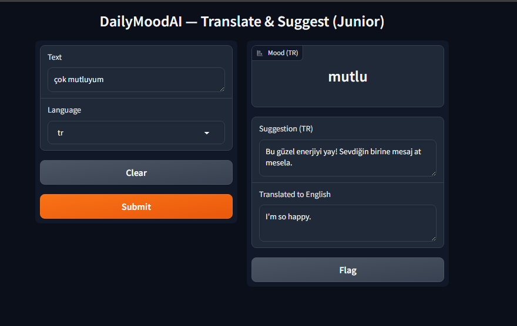
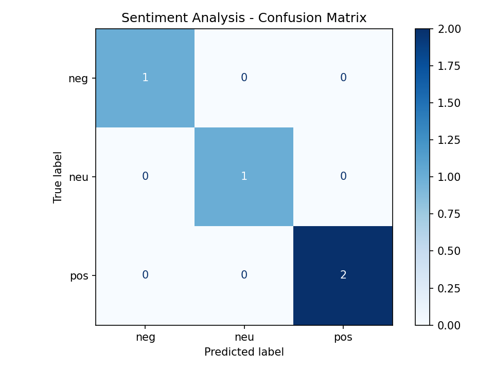
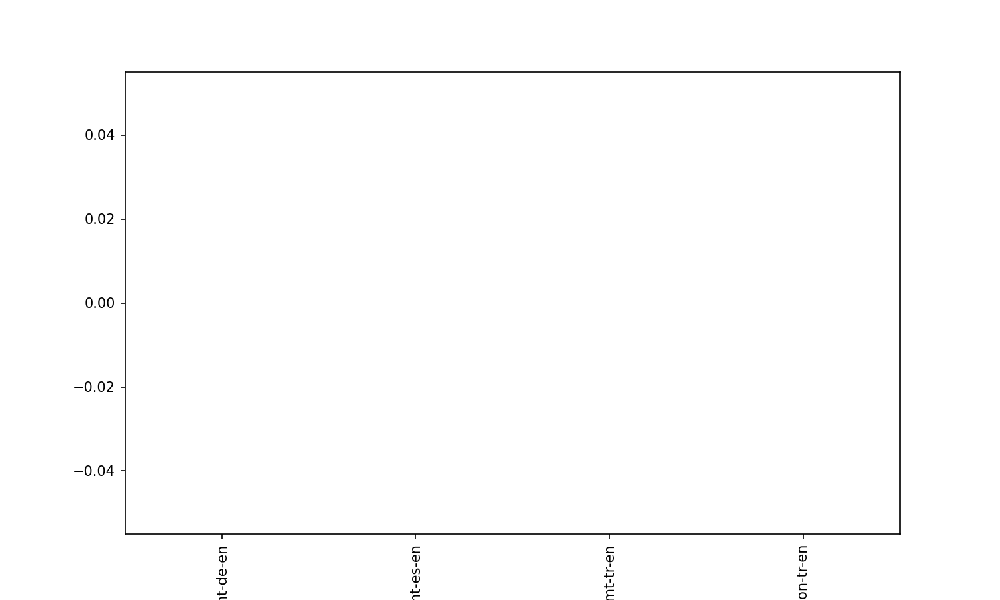

# DailyMoodAI 🎭

- DailyMoodAI is a multilingual **mood & advice assistant** powered by translation and sentiment analysis.  
- It translates user input into English, classifies mood, and returns a suitable advice from a JSON file.  
- It also provides **BLEU/ROUGE metrics** for translation quality, **Confusion Matrix** for sentiment analysis and simple **cost/latency logging** for reproducibility.  

The project runs fully **locally and free of charge**, using Hugging Face MarianMT and nlptown sentiment models.

---

## 🚀 Features
- Multilingual translation (tr/de/es → en) with MarianMT
- Mood detection & advice generation (`data/suggestions.json`)
- BLEU/ROUGE metrics for translation (`translate-eval`)
- Sentiment analysis with Confusion Matrix (`sentiment-eval`)
- Gradio user interface (`ui`)
- Route/cost logging and summary (`cost-summary`)
  
---

## 📊 Example Outputs

### Gradio UI


### Confusion Matrix


### Cost Plot


---

## 📦 Installation

```bash
git clone <repo-url>
cd DailyMoodAI
pip install -r requirements.txt

🗂️ Project Structure
DailyMoodAI/
├─ data/
│  ├─ suggestions.json
│  ├─ translation_eval.csv
│  └─ sentiment_eval.csv
├─ reports/
│  ├─ bleu_rouge.json
│  ├─ confusion_matrix.png
│  ├─ cost_summary.json
│  ├─ cost_plot.png
│  └─ example_ui.PNG
├─ scripts/
│  ├─ main.py
│  ├─ inference.py
│  └─ route_logger.py
└─ README.md
```

---

## ⚙️ Commands

### Translation evaluation
python -m scripts.main translate-eval --csv data/translation_eval.csv

### Sentiment evaluation
python -m scripts.main sentiment-eval --csv data/sentiment_eval.csv

### Mood & advice (CLI)
python -m scripts.main suggest --text "I'm very tired today" --lang en

### Gradio interface
python -m scripts.main ui --port 7860
# then open http://127.0.0.1:7860 in your browser

### Cost / latency summary
python -m scripts.main cost-summary

---


## 📑 Notes

- Translation: Helsinki-NLP MarianMT

- Sentiment: nlptown/bert-base-multilingual-uncased-sentiment

- All models run locally on CPU, internet is only required for the initial download.

📝 License
MIT
