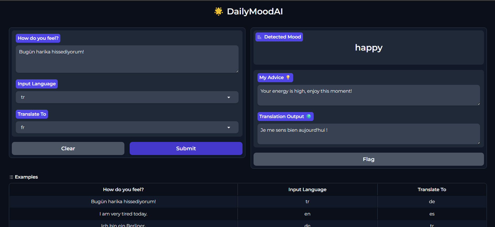

# 🌟 DailyMoodAI - Multilingual Emotional Intelligence Assistant


**DailyMoodAI** is an advanced AI-powered assistant designed to break language barriers and provide emotional support. It leverages **Deep Learning (Transformers)** and **Pivot Translation Architecture** to understand user sentiment across multiple languages and offer personalized advice.

> **Status:** v1.2 (Active Development) 🐳

---

## 📊 Evaluation & Metrics / Değerlendirme

### 1. Gradio Interface (Arayüz)


### 2. Sentiment Analysis Performance
Confusion matrix generated using `scikit-learn` on a test dataset.


### 3. API Latency & Cost
Since the project uses local models, the API cost is **$0.00**.


---

## 🛠️ Technical Architecture

The project is built on a modular architecture combining **NLP**, and **Full-Stack Python** principles.

### Core Technologies
| Component | Technology / Library | Purpose |
| :--- | :--- | :--- |
| **Translation** | `Helsinki-NLP/opus-mt` (Transformers) | Bi-directional translation (Source ↔ English) |
| **Sentiment Analysis** | `nlptown/bert-base-multilingual` | BERT-based emotion detection (5-class) |
| **Backend Logic** | `Python 3.10`, `Pandas`, `NumPy` | Data processing & business logic |
| **Interface** | `Gradio` (Web UI), `Argparse` (CLI) | User interaction layers |
| **MLOps & DevOps** | `Git` | Containerization & Version Control |
| **Evaluation** | `SacreBLEU`, `ROUGE`, `Scikit-learn` | Model performance metrics |


### 🔄 Workflow Logic (RAG-Inspired)
- 1-  Input Processing: User input is normalized and translated to English (Pivot Language).
- 2-  Sentiment Inference: The English text is passed through the BERT model to extract sentiment probabilities.
- 3-  Advice Retrieval: Based on the sentiment, a context-aware advice is retrieved from a structured JSON dataset (simulating RAG retrieval).
- 4-  Response Generation: The selected advice is translated back to the user's native language.

---

## 📂 Project Structure

The project follows a scalable and modular directory structure suitable for production deployment.

```bash
DailyMoodAI/
├── data/               # Data for evaluation and suggestions (JSON/CSV)
├── models/             # Local model storage (placeholder)
├── notebooks/          # Jupyter notebooks for experiments (EDA & Tests)
├── reports/            # Generated metrics, logs, plots, and screenshots
├── scripts/            # Source code modules
│   ├── inference.py    # Core NLP logic (Translation & Sentiment)
│   ├── main.py         # CLI and UI entry point
│   └── route_logger.py # Cost/Latency tracking
├
├── requirements.txt    # Python dependencies
├── run_ui.bat          # Quick start script for Windows 
└── README.md           # Documentation
```
--- 

## 📊 Evaluation & Metrics
The project includes built-in evaluation scripts to ensure model reliability.

### 1. Sentiment Analysis Performance
Confusion matrix generated using scikit-learn on a test dataset.

### 2. API Latency & Cost
Since the project uses local models (CPU-optimized), the API cost is $0.00. Latency is tracked per request.

--- 

## 🚀 Installation & Usage


 Local Development:
``` bash

# 1. Install Dependencies
pip install -r requirements.txt

# 2. Run Application via CLI
python -m scripts.main ui
```

---

## 🇹🇷 Türkçe Özet

DailyMoodAI, Doğal Dil İşleme (NLP) ve Generative AI tekniklerini kullanarak geliştirdiğim, çok dilli (multilingual) bir duygu analizi ve kişisel asistan projesidir. Projeyi uçtan uca (end-to-end) tasarladım.
- Ana Mimari: Sistemin mimarisinde ölçeklenebilirlik ve verimlilik sağlamak için 'Pivot Çeviri Mimarisi' (Pivot Translation Architecture) kullandım. Çalışma mantığı şu 4 ana adımdan oluşur:
- 1- Giriş Normalizasyonu (Pivot Step): "Kullanıcı Türkçe, Almanca veya İspanyolca girdiğinde, sistem bunu önce Hugging Face MarianMT modelleriyle 'Pivot Dil' olan İngilizceye çevirir. Bu sayede her dil için ayrı analiz modeli eğitmek yerine, tek ve güçlü bir İngilizce analiz motoru kullanabildim."
- 2- Hibrit Analiz Motoru (Hybrid Inference): "Analiz aşamasında iki katmanlı bir yapı kurdum. İlk katmanda BERT tabanlı (nlptown/bert-base) bir model ile metnin genel duygu polaritesini (Pozitif/Negatif) ölçüyorum. İkinci katmanda ise, kendi geliştirdiğim kural tabanlı (rule-based) algoritmalarla 'Yorgunluk', 'Kaygı' gibi spesifik ruh hallerini tespit ediyorum.
- 3- Retrieval (Bilgi Getirme): "Burada Vektör DB maliyetine girmeden, 'Sınıflandırma Tabanlı Getirme' (Classification-Based Retrieval) yöntemini uyguladım. Tespit edilen duygu etiketine göre, sistem JSON tabanlı bilgi tabanımdan (Knowledge Base) bağlama en uygun tavsiyeyi çekiyor.
- 4- Yanıt Üretimi (Response Generation): "Seçilen İngilizce tavsiye, tekrar kullanıcının ana diline çevriliyor ve kullanıcıya sunuluyor. Böylece tamamen yerelleştirilmiş bir deneyim sağlanıyor.
- Sadece modelin doğruluğuna değil, yazılımın kalitesine de odaklandım;
- Değerlendirme (Evaluation): Model performansını ölçmek için BLEU/ROUGE skorlarını (çeviri için) ve Confusion Matrix (duygu analizi için) hesaplayan otomatik test scriptleri yazdım.
- Arayüz: Python ve Gradio kullanarak interaktif bir web arayüzü geliştirdim.

---

### 🚀 Öne Çıkan Özellikler

* **🌍 Çift Yönlü Akıllı Çeviri:** **Türkçe, İngilizce, Almanca, İspanyolca ve Fransızca** dilleri arasında köprü kurar. "Pivot Çeviri" mimarisiyle (Kaynak -> İngilizce -> Hedef) çalışır.

* **🧠 Duygu ve Ruh Hali Analizi:**
    * **Sentiment:** `nlptown/bert-base-multilingual` (BERT) modelini kullanarak metnin genel duygu durumunu (Pozitif/Negatif) ölçer.
    * **Mood Detection:** Özel olarak geliştirilen **kural tabanlı (rule-based)** algoritma ile "Yorgun", "Kaygılı" veya "Üzgün" gibi spesifik ruh hallerini tespit eder.

* **💡 Kişisel Tavsiyeler:** Tespit edilen duyguya göre bağlamsal bir tavsiye üretir ve bunu kullanıcının diline geri çevirir.
* **💻 Çift Arayüz:** Hem web arayüzü (**Gradio**) hem de profesyonel komut satırı (**CLI**) desteği sunar.

---

## 🛠️ Kurulum

``` bash

# 1. Kütüphaneleri Yükle
pip install -r requirements.txt

# 2. Uygulamayı Başlat
python -m scripts.main ui
``` 
---

## 🖥️ CLI (Terminal) Kullanımı
Uygulamayı arayüz olmadan, doğrudan komut satırından da test edebilirsiniz.

``` bash

# Metin analizi ve tavsiye al
python -m scripts.main suggest --text "Bugün harika hissediyorum" --lang tr

# Çeviri kalitesini ölç (BLEU/ROUGE skorları)
python -m scripts.main translate-eval --csv data/translation_eval.csv

# Maliyet ve hız raporunu gör
python -m scripts.main cost-summary
```
---

## 🏗️ Kullanılan Teknolojiler 

- Çekirdek: Python 3.10, PyTorch, Pandas

- Modeller: Hugging Face Transformers (Çeviri için MarianMT, Duygu için BERT)

- Arayüz: Gradio (Web UI), Argparse (CLI)

- DevOps: Git

---

## 📂 Proje Yapısı

Proje, ölçeklenebilir ve modüler bir yapıda tasarlanmıştır.


```bash
DailyMoodAI/
├── data/               # Değerlendirme verileri ve öneri veritabanı (JSON/CSV)
├── models/             # Yerel model depolama alanı (yer tutucu)
├── notebooks/          # Deneyler ve keşifçi veri analizi (EDA) için Jupyter not defterleri
├── reports/            # Üretilen raporlar, grafikler ve ekran görüntüleri
│   ├── demo_view.png       # Arayüz Ekran Görüntüsü
│   ├── confusion_matrix.png # Model performans görselleştirmesi
│   ├── cost_plot.png       # API gecikme/maliyet takibi
│   └── route_logger.csv    # İstek logları
│
├── scripts/            # Kaynak kod modülleri
│   ├── __init__.py         # Paket başlatıcı
│   ├── inference.py        # Çekirdek NLP mantığı (Çeviri & Duygu)
│   ├── main.py             # CLI ve UI giriş noktası
│   └── route_logger.py     # Metrik loglama aracı
│
├
├── requirements.txt    # Python bağımlılıkları 
├── run_ui.bat          # Windows için hızlı başlatma 
└── README.md           # Proje dokümantasyonu
```
---

## 📊 Değerlendirme ve Metrikler
- Proje, model güvenilirliğini ölçmek için dahili test araçları içerir:

- Duygu Analizi Başarısı: Karmaşıklık Matrisi (Confusion Matrix) ile görselleştirilir.

- Maliyet ve Hız: Yerel modeller kullanıldığı için API maliyeti $0.00'dır. Gecikme süreleri (latency) takip edilir.

👤 Hazırlayan
Esmanur Erdiş 